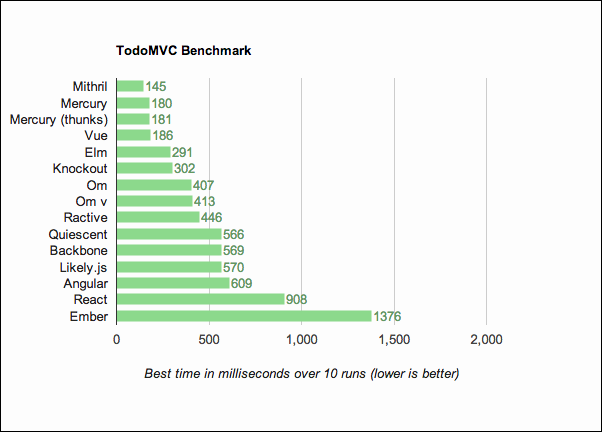
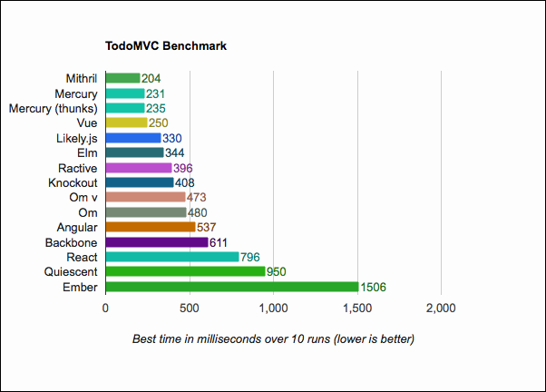
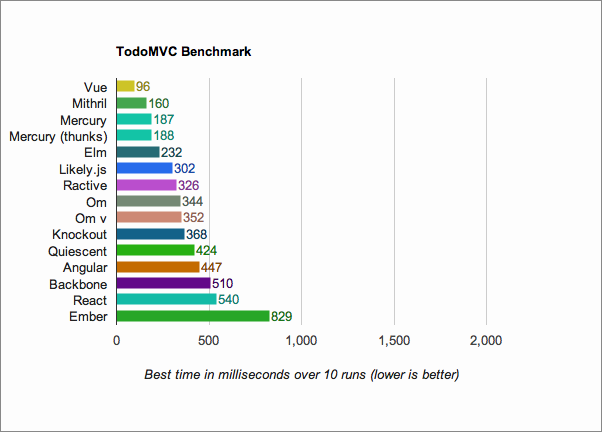
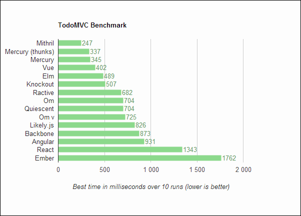
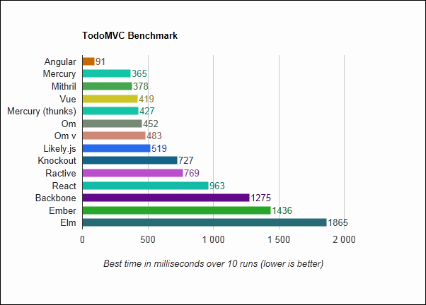

# TodoMVC Benchmark

Performance benchmarks for various TodoMVC implementations

## Results 

*  OS X 10.8: MacBook Air,Core i5 @1.8GHz)
* Windows Vista: Pentium T4200 2GHz

### Overall:

Mercury, Vue and Mithril are king. Elm is a close fourth, except on IE9 where it is very slow. 

Ember is the slowest overall; Angular, React and Backbone are trailing too.

### Chrome 35, OS X

### Firefox 31, OS X

### Safari 6.1, OS X

### Chrome 35, Windows Vista

### IE9, Windows Vista

Note that the Angular Benchmark is not working ATM, in IE9, hence the ridiculous score.

